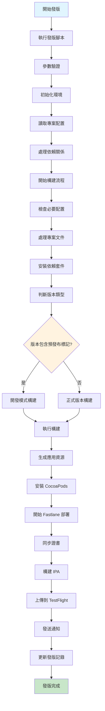
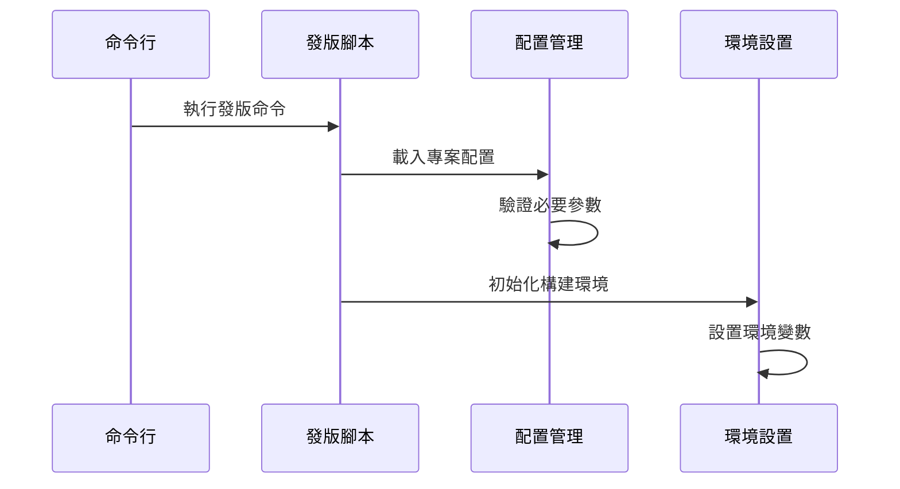
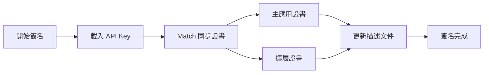
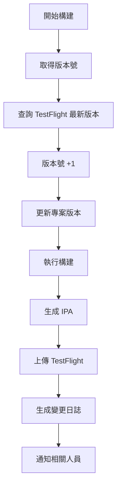

還記得上次手動發版 iOS App 的經歷嗎？打開 Xcode、選擇正確的 scheme、archive、上傳到 App Store Connect、填寫測試資訊、通知測試人員... 整個流程下來至少要花上 20 ~ 30 分鐘，而且還要祈禱中間不要出錯。

想像一下，在發版日的早上，你一邊喝著咖啡，一邊執行一個命令，然後就可以執行其他的工作。這不是夢，這是我們團隊最近實現的 iOS App 自動化發版流程。

## 目錄

- [先看看完整的自動化流程長什麼樣子](#先看看完整的自動化流程長什麼樣子)
- [開始之前，你需要準備什麼？](#開始之前你需要準備什麼)
  - [安裝必要套件](#安裝必要套件)
- [來詳細了解每個步驟](#來詳細了解每個步驟)
  - [1. 一切從一個命令開始](#1-一切從一個命令開始)
    - [完整的 release.sh 腳本範例](#完整的-releasesh-腳本範例)
  - [2. 腳本內部的魔法](#2-腳本內部的魔法)
  - [3. Fastlane - 自動化的靈魂](#3-fastlane---自動化的靈魂)
    - [Fastlane 的基本概念](#fastlane-的基本概念)
  - [4. 證書和簽名管理](#4-證書和簽名管理)
    - [Match 的流程圖](#match-的流程圖)
    - [如何在 GitHub/GitLab 透過 Match 管理證書](#如何在-githubgitlab-透過-match-管理證書)
    - [初始設置 Match](#初始設置-match)
    - [在 Fastlane 中使用 Match](#在-fastlane-中使用-match)
    - [Matchfile 配置範例](#matchfile-配置範例)
    - [刪除所有證書和描述文件](#刪除所有證書和描述文件)
  - [5. 構建和上傳](#5-構建和上傳)
    - [gym 的基本使用](#gym-的基本使用)
    - [上傳到 TestFlight](#上傳到-testflight)
  - [6. 通知系統 - 讓團隊知道發生了什麼](#6-通知系統---讓團隊知道發生了什麼)
    - [Slack 通知範例](#slack-通知範例)
- [當出問題時怎麼辦？](#當出問題時怎麼辦)
  - [常見問題及解決方案](#常見問題及解決方案)
    - [1. 證書問題（十個問題有九個是它）](#1-證書問題十個問題有九個是它)
    - [2. 構建失敗](#2-構建失敗)
    - [3. TestFlight 上傳失敗](#3-testflight-上傳失敗)
  - [除錯小技巧](#除錯小技巧)
- [進階玩法 - 讓自動化更強大](#進階玩法---讓自動化更強大)
  - [CI/CD 整合 - 真正的解放雙手](#cicd-整合---真正的解放雙手)
    - [GitHub Actions 範例](#github-actions-範例)
- [結語 - 自動化帶來的改變](#結語---自動化帶來的改變)
  - [給你的建議](#給你的建議)
  - [學習資源](#學習資源)

## 先看看完整的自動化流程長什麼樣子

在深入細節之前，先讓你看看整個自動化流程的全貌。別被這個流程圖嚇到，我會一步步解釋每個環節：



## 開始之前，你需要準備什麼？

### 安裝必要套件

打開你的終端機，依序執行以下命令：

```bash
# 安裝 Fastlane
# 如果你還沒有安裝 Fastlane，可以使用 Homebrew 或 RubyGems 安裝

# 使用 Homebrew 安裝
brew install fastlane
# 或者使用 RubyGems 安裝
gem install fastlane

# 安裝 CocoaPods
# 使用 Homebrew 安裝
brew install cocoapods
# 或者使用 RubyGems 安裝
gem install cocoapods

# 安裝 Xcode Command Line Tools
xcode-select --install
```

## 來詳細了解每個步驟

### 1. 一切從一個命令開始

首先，需要為你的 iOS App 準備一個發版腳本。這個腳本會處理所有的發版流程，包括依賴管理、構建、上傳等。

你可以在這個腳本中帶入一些參數來控制發版流程，比如測試人員、版號、發版描述等。這樣可以讓每次發版都更有條理。

以下是一個簡單的命令範例：

```bash
./release.sh "test@example.com" "1.2.3" "修復了一個重要的 bug"
```

#### 完整的 release.sh 腳本範例

```bash
#!/bin/bash

# release.sh - iOS App 自動發版腳本
# 使用方式: ./release.sh <測試人員郵件> <版本號> <發版說明>

set -e  # 遇到錯誤立即停止

# 顏色定義
RED='\033[0;31m'
GREEN='\033[0;32m'
YELLOW='\033[1;33m'
NC='\033[0m' # No Color

# 參數驗證
if [ $# -lt 3 ]; then
    echo -e "${RED}錯誤: 參數不足${NC}"
    echo "使用方式: $0 <測試人員郵件> <版本號> <發版說明>"
    exit 1
fi

TESTERS=$1
VERSION=$2
RELEASE_NOTES=$3

echo -e "${GREEN}🚀 開始 iOS App 發版流程${NC}"
echo "版本號: $VERSION"
echo "測試人員: $TESTERS"
echo "發版說明: $RELEASE_NOTES"

# 步驟 1: 環境檢查
echo -e "\n${YELLOW}步驟 1: 檢查環境...${NC}"
command -v fastlane >/dev/null 2>&1 || { 
    echo -e "${RED}錯誤: 未安裝 Fastlane${NC}"
    exit 1
}

# 步驟 2: 更新依賴
echo -e "\n${YELLOW}步驟 2: 更新依賴...${NC}"
bundle install
pod install --repo-update

# 步驟 3: 執行測試
echo -e "\n${YELLOW}步驟 3: 執行測試...${NC}"
fastlane test

# 步驟 4: 更新版本號
echo -e "\n${YELLOW}步驟 4: 更新版本號...${NC}"
/usr/libexec/PlistBuddy -c "Set :CFBundleShortVersionString $VERSION" "./Info.plist"

# 步驟 5: 構建並上傳
echo -e "\n${YELLOW}步驟 5: 構建並上傳到 TestFlight...${NC}"
fastlane deploy_testflight \
    testers:"$TESTERS" \
    changelog:"$RELEASE_NOTES"

# 步驟 6: 發送通知
echo -e "\n${YELLOW}步驟 6: 發送通知...${NC}"
python3 send_notification.py "$VERSION" "$RELEASE_NOTES"

# 步驟 7: 創建 Git Tag
echo -e "\n${YELLOW}步驟 7: 創建 Git Tag...${NC}"
git tag -a "v$VERSION" -m "Release version $VERSION"
git push origin "v$VERSION"

echo -e "\n${GREEN}✅ 發版完成！${NC}"
echo -e "版本 $VERSION 已成功上傳到 TestFlight"
```

### 2. 腳本內部的魔法

當你執行完命令後，腳本會開始做一些初始化工作。這部分你不需要太擔心，但了解一下會有助於 debug：



### 3. Fastlane - 自動化的靈魂

這裡要隆重介紹 Fastlane，它是整個自動化流程的核心。Fastlane 可以幫助你自動化繁瑣的發版流程，讓你專注於開發。

#### Fastlane 的基本概念

Fastlane 使用一個名為 `Fastfile` 的配置文件來定義你的發版流程。這個文件包含了所有的 lane（任務），每個 lane 都代表一個特定的發版任務。

下面是一個簡單的 Fastfile 範例：

```ruby
default_platform(:ios)

platform :ios do
  desc "部署到 TestFlight"
  lane :deploy_testflight do
    # 同步證書
    sync_code_signing(
      type: "appstore",
      readonly: true
    )
    
    # 自動遞增版本號
    increment_build_number(
      build_number: latest_testflight_build_number() + 1
    )
    
    # 構建應用
    build_app(
      scheme: "YourApp",
      export_method: "app-store"
    )
    
    # 上傳到 TestFlight
    upload_to_testflight(
      skip_waiting_for_build_processing: true,
      distribute_external: true,
      groups: ["Beta Testers"]
    )
    
    # 發送通知
    send_notification
  end
  
  desc "發送通知"
  private_lane :send_notification do
    # 通知邏輯
  end
end
```

### 4. 證書和簽名管理

在 iOS 發版中，證書和簽名是非常重要的一環。Fastlane 提供了 `match` 功能來幫助你管理證書和描述文件。

團隊開發時，建議使用 Git 存儲證書，這樣可以確保所有團隊成員都使用相同的證書。

#### Match 的流程圖



#### 如何在 GitHub/GitLab 透過 Match 管理證書

Match 可以與 GitHub 或 GitLab 集成，這樣你就可以在 CI/CD 流程中自動管理證書和描述文件。

當你執行 `fastlane match` 時，它會自動從指定的 Git 倉庫中拉取證書和描述文件，並將它們安裝到你的 Xcode 環境中

#### 初始設置 Match

第一次使用 Match 時，你需要先設置好你的證書和描述文件。這可以通過以下命令完成：

```bash
fastlane match init
```

這個命令會引導你完成證書和描述文件的設置過程。你需要提供一些基本信息，比如你的 Apple ID、應用識別碼等。

然後，你可以在 `Fastfile` 中使用 `match` 來同步證書和描述文件。

#### 在 Fastlane 中使用 Match

在你的 `Fastfile` 中，你可以這樣使用 `match` 來將證書和描述文件同步到本地：

```ruby
match(
  app_identifier: "com.yourcompany.app",
  clone_branch_directly: true,
  api_key: "your-api-key",
  type: "appstore",
  storage_mode: "git",
  git_url: "https://github.com/your-org/project-name.git",
  git_branch: "your-branch-name",
  username: "your-apple-id@company.com",
  keychain_password: "your-keychain-password"
)
```

如果你需要在憑證過期或丟失時重新生成，可以加入以下命令：

```ruby
match(
  app_identifier: "com.yourcompany.app",
  clone_branch_directly: true,
  api_key: "your-api-key",
  type: "appstore",
  storage_mode: "git",
  git_url: "https://github.com/your-org/project-name.git",
  git_branch: "your-branch-name",
  username: "your-apple-id@company.com",
  keychain_password: "your-keychain-password",
  force: true # 強制重新生成證書
)
```

如果你不想讓其他人修改證書，可以使用 `readonly: true`，其他團隊成員將無法修改證書：

```ruby
match(
  app_identifier: "com.yourcompany.app",
  clone_branch_directly: true,
  api_key: "your-api-key",
  type: "appstore",
  storage_mode: "git",
  git_url: "https://github.com/your-org/project-name.git",
  git_branch: "your-branch-name",
  username: "your-apple-id@company.com",
  keychain_password: "your-keychain-password",
  readonly: true
)
```

***參數說明***

以下為 `match` 各參數代表的意義

- `app_identifier`: 你的應用程式識別碼
- `clone_branch_directly`: 是否直接克隆 Git 分支
- `api_key`: Fastlane API 金鑰
- `type`: 證書類型（如 `appstore`、`development` 等）
- `storage_mode`: 存儲模式（如 `git`）
- `git_url`: 存儲證書的 Git 倉庫 URL
- `git_branch`: 存儲證書的 Git 分支名稱
- `username`: 你的 Apple ID
- `keychain_password`: 鑰匙串密碼
- `force`: 是否強制重新生成證書（可選）
- `readonly`: 是否只讀，防止其他人修改證書（可選）
- `api_key_path`: 如果你有 API 金鑰文件，可以指定路徑

#### Matchfile 配置範例

你可以創建一個 `Matchfile` 來簡化 Match 的配置：

```ruby
# Matchfile - Match 配置文件

# Git 存儲設定
git_url("https://github.com/your-org/certificates.git")
git_branch("master")

# 存儲模式
storage_mode("git")

# 應用識別碼
app_identifier(["com.yourcompany.app", "com.yourcompany.app.widget"])

# Apple 開發者帳號
username("your-apple-id@company.com")

# 團隊 ID
team_id("YOUR_TEAM_ID")

# 是否為只讀模式（CI/CD 環境建議使用）
readonly(false)

# 是否直接克隆分支
clone_branch_directly(true)

# 自動生成描述文件名稱
generate_apple_certs(true)

# 平台
platform("ios")

# 證書類型
type("appstore") # 可以是 development, adhoc, appstore, enterprise

# Keychain 設定（可選）
keychain_name("login.keychain")
keychain_password(ENV["KEYCHAIN_PASSWORD"])

# 強制更新（可選）
force_for_new_devices(true)
```

#### 刪除所有證書和描述文件

當你想清除所有證書和描述文件時，可以使用以下命令：

```bash
fastlane match nuke distribution
```

這個命令會刪除所有的發行證書，並且會要求你確認操作。

### 5. 構建和上傳

構建和上傳是整個流程的核心部分。這裡我們使用 Fastlane 的 `gym` 來構建應用，並使用 `upload_to_testflight` 上傳到 TestFlight。

#### gym 的基本使用

`gym` 是 Fastlane 的一個工具，用於構建 iOS 應用。你可以在 `Fastfile` 中這樣使用：

```ruby
gym(
  workspace: "YourApp.xcworkspace",
  scheme: "your_scheme",
  configuration: "Release",
  output_directory: "./build",
  include_bitcode: false, # 是否包含 Bitcode
  xcargs: "-allowProvisioningUpdates", # 允許自動更新描述文件
  export_options: {
    method: "app-store", # 發行方式
    manageAppVersionAndBuildNumber: true, # 自動管理版本號和構建號
    provisioningProfiles: {
      "com.yourcompany.app" => "YourApp AppStore Profile" # 描述文件
    }
  }
)
```

***參數說明***

- `workspace`: 你的 Xcode 工作區文件
- `scheme`: 構建的 scheme 名稱
- `configuration`: 構建配置（如 Release）
- `output_directory`: 構建輸出目錄
- `include_bitcode`: 是否包含 Bitcode
- `xcargs`: 傳遞給 Xcode 的額外參數
- `export_options`: 構建導出選項，包括發行方式、版本號和描述文件等

#### 上傳到 TestFlight

在構建完成後，你可以使用 `upload_to_testflight` 將應用上傳到 TestFlight。但在這之前，你可以先查詢 TestFlight 上的最新版本號，然後自動遞增版本號。

以下是自動遞增版本號的範例：

```ruby
# 查詢 TestFlight 最新版本號
latest_build_number = latest_testflight_build_number()

# 如果沒有找到最新版本號，則默認為 0
if latest_build_number.nil?
  latest_build_number = 0
end

# 輸出最新版本號
puts "最新版本號: #{latest_build_number}"

# 自動遞增版本號
increment_build_number(build_number: latest_build_number + 1)
```

在自動遞增版本號後，你可以使用 `upload_to_testflight` 上傳應用：

```ruby
upload_to_testflight(
  ipa: "./build/YourApp.ipa", # 構建的 IPA 文件路徑
  skip_waiting_for_build_processing: true, # 跳過等待構建處理
  distribute_external: true, # 是否分發給外部測試人員
  groups: ["Beta Testers"], # 測試群組
  changelog: "修復了一個重要的 bug" # 發版說明
)
```

執行完這些步驟後，你的應用就會被上傳到 TestFlight，並且測試人員會收到通知。

以下是構建和上傳的流程圖：



### 6. 通知系統 - 讓團隊知道發生了什麼

自動化的最後一步，是讓團隊成員知道發版狀態。你可以透過 Email、LINE、Slack、Teams 或 Google Chat 的 Webhook 來通知他們。

以下是一個使用 python3 寫的發送 Chat 通知的範例：

```python
import requests
import json
from typing import Optional

def send_chat_notification(message: str, webhook_url: str) -> bool:
    """
    發送通知到 Google Chat
    
    Args:
        message: 要發送的訊息
        webhook_url: Google Chat Webhook URL
        
    Returns:
        bool: 發送是否成功
    """
    try:
        headers = {"Content-Type": "application/json"}
        payload = {"text": message}
        
        response = requests.post(
            webhook_url, 
            headers=headers, 
            json=payload,
            timeout=10
        )
        
        if response.status_code == 200:
            print("✅ 通知發送成功")
            return True
        else:
            print(f"❌ 發送失敗: {response.status_code}")
            return False
            
    except requests.exceptions.RequestException as e:
        print(f"❌ 發送錯誤: {str(e)}")
        return False

if __name__ == "__main__":
    # Webhook URL 應該從環境變數或配置文件讀取
    webhook_url = "https://chat.googleapis.com/v1/spaces/XXX/messages?key=XXX"
    
    message = """
    🚀 iOS App 發版成功！
    📱 版本號：1.2.3
    👥 測試群組：Beta Testers
    📝 更新內容：修復重要 bug
    """
    
    send_chat_notification(message, webhook_url)
```

這段程式碼會將發版成功的消息發送到指定的 Google Chat 空間。

#### Slack 通知範例

如果你的團隊使用 Slack，這裡是一個 Slack 通知的範例：

```python
import requests
import json

def send_slack_notification(message: str, webhook_url: str) -> bool:
    """
    發送通知到 Slack
    
    Args:
        message: 要發送的訊息
        webhook_url: Slack Webhook URL
        
    Returns:
        bool: 發送是否成功
    """
    try:
        payload = {
            "blocks": [
                {
                    "type": "header",
                    "text": {
                        "type": "plain_text",
                        "text": "🚀 iOS App 發版通知"
                    }
                },
                {
                    "type": "section",
                    "fields": [
                        {"type": "mrkdwn", "text": "*版本號:*\n1.2.3"},
                        {"type": "mrkdwn", "text": "*環境:*\nTestFlight"},
                        {"type": "mrkdwn", "text": "*測試群組:*\nBeta Testers"},
                        {"type": "mrkdwn", "text": "*構建時間:*\n2025-08-13 10:30"}
                    ]
                },
                {
                    "type": "section",
                    "text": {
                        "type": "mrkdwn",
                        "text": "*更新內容:*\n• 修復登入問題\n• 優化性能\n• 新增深色模式"
                    }
                }
            ]
        }
        
        response = requests.post(webhook_url, json=payload, timeout=10)
        
        if response.status_code == 200:
            print("✅ Slack 通知發送成功")
            return True
        else:
            print(f"❌ 發送失敗: {response.status_code}")
            return False
            
    except requests.exceptions.RequestException as e:
        print(f"❌ 發送錯誤: {str(e)}")
        return False
```

## 當出問題時怎麼辦？

即使有了自動化，還是會遇到問題。這裡整理了最常見的幾個問題和解決方法：

### 常見問題及解決方案

#### 1. 證書問題（十個問題有九個是它）

```bash
# 重新同步證書
fastlane match appstore --readonly false

# 清除本地證書快取
fastlane match nuke distribution
```

#### 2. 構建失敗

```bash
# 清理構建快取
xcodebuild clean -workspace YourApp.xcworkspace -scheme YourApp
rm -rf ~/Library/Developer/Xcode/DerivedData
```

#### 3. TestFlight 上傳失敗

遇到這個問題時，通常是以下幾個原因：

- App Store Connect API Key 過期或無效
- Bundle ID 寫錯了（別笑，我真的遇過）
- 版本號已經存在（忘記更新版本號）
- 網路不穩（特別是上傳大檔案時）

### 除錯小技巧

這些小技巧可以幫你快速找到問題：

1. **啟用詳細日誌**

```bash
fastlane deploy_testflight --verbose
```

2. **檢查環境變數**

```bash
printenv | grep -E "(FASTLANE|APP_STORE)"
```

3. **驗證配置文件**

```bash
fastlane run validate_config
```

## 進階玩法 - 讓自動化更強大

### CI/CD 整合 - 真正的解放雙手

如果你覺得連執行一個命令都太麻煩，那就讓 CI/CD 幫你做吧。只要透過 GitHub Action 或 GitLab CI，就能實現自動發版！

#### GitHub Actions 範例

```yaml
name: iOS Deploy

on:
  push:
    tags:
      - 'v*'

jobs:
  deploy:
    runs-on: macos-latest
    steps:
      - uses: actions/checkout@v3
      
      - name: Setup Ruby
        uses: ruby/setup-ruby@v1
        with:
          ruby-version: '3.0'
          bundler-cache: true
      
      - name: Install Dependencies
        run: |
          bundle install
          pod install
      
      - name: Deploy to TestFlight
        env:
          APP_STORE_CONNECT_API_KEY: ${{ secrets.ASC_API_KEY }}
        run: |
          fastlane deploy_testflight
```

## 結語 - 自動化帶來的改變

回想當初手動發版的日子，每次發版都要等待漫長的時間無法進行其他工作。現在有了自動化，發版變成了一件輕鬆的事。

### 給你的建議

如果你正在考慮是否要導入自動化發版，我的建議是：**別猶豫了，現在就開始！**

不需要一次到位，可以從最簡單的開始：

1. 先用 Fastlane 自動化構建
2. 再加入 TestFlight 上傳
3. 最後加入通知和 CI/CD

### 學習資源

- [Fastlane 官方文檔](https://docs.fastlane.tools/)
- [CocoaPods 指南](https://guides.cocoapods.org/)
- [GitHub Actions 教學](https://docs.github.com/en/actions)

希望這篇分享能幫助你開始自動化發版之旅。如果你在實作過程中遇到問題，歡迎留言討論！

---

*謝謝你讀到這裡！如果這篇文章對你有幫助，歡迎分享給需要的朋友。*
